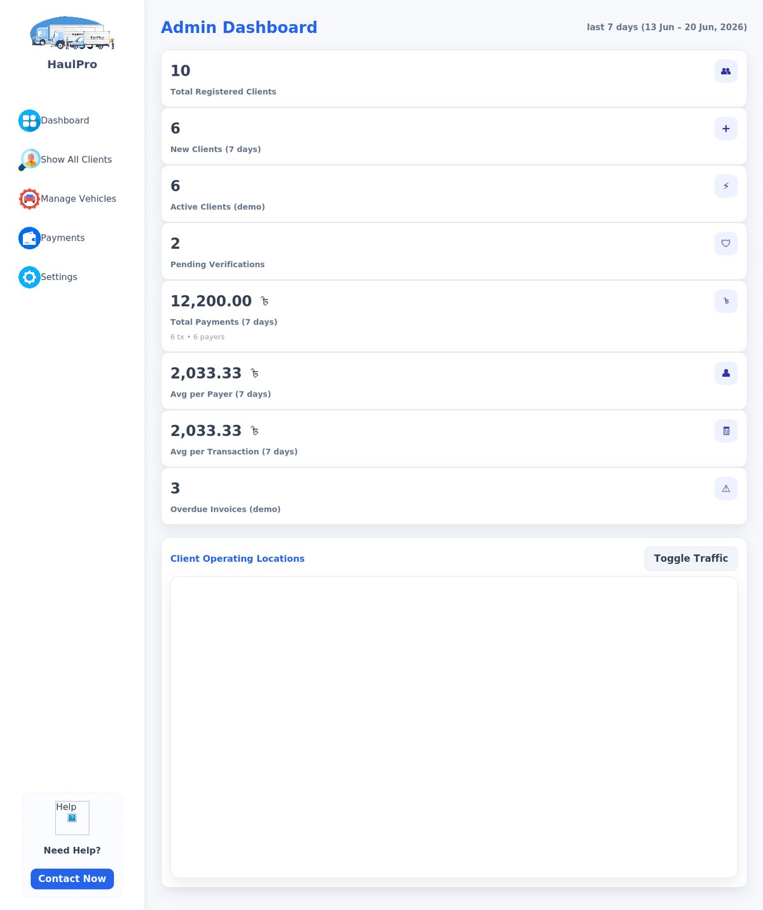

# 🚚 HaulPro — Truck & Logistics Management System

A full-stack **web application for managing a trucking / haulage business**, built with **PHP, MySQL and vanilla JS**. HaulPro brings fleet operations, client billing, payments and business analytics into one dashboard — covering everything from registering lorry owners and assigning trips to tracking revenue, fleet utilization and delivery performance.

<p align="center">
  
</p>

<p align="center">
  
  
  
  
  
</p>

---

## ✨ Features

- **Secure authentication** — email/password login and registration with `password_hash` (bcrypt) and PHP sessions, all queries run through prepared statements.
- **Customer dashboard** — dynamic KPI tiles (vehicles, active fleet, dues, loads, weekly earnings) that compute live from the database with graceful fallbacks when data is missing.
- **Admin area** — manage clients, vehicles and payments, plus an admin dashboard with 7-day KPIs.
- **Fleet & owner management** — full CRUD for lorry owners / vehicles (type, owner, capacity, driver, status, contact, notes) and a sortable lorry list.
- **Trip management** — create trips with origin/destination, driver, truck and status (Pending → Accepted → Pickup → Completed / Cancelled).
- **Payment center** — invoices, invoice items, recorded payments, saved payment methods (card / mobile wallet / bank) and billing preferences.
- **Business analytics** — Revenue, Fleet and Delivery-Performance pages with KPI cards and **Chart.js** visualizations.
- **Trip distance calculator** — pick origin and destination to get the route distance (AJAX) with a Google-Maps view.
- **FAQ & receipts** — a customer FAQ page and printable payment receipts.

---


## 🛠️ Tech Stack

| Layer | Technology |
|---|---|
| Backend | PHP (procedural, `mysqli` with prepared statements) |
| Database | MySQL / MariaDB |
| Frontend | HTML5, CSS3 (custom properties, flexbox/grid), vanilla JavaScript |
| Charts | Chart.js (via jsDelivr CDN) |
| Maps | Google Maps embed (`maps.html`) |
| Auth | bcrypt password hashing + PHP sessions |

---

## 📁 Project Structure

```
testing_Repo/
├── db.php                     # MySQL connection (DB: webtech_project)
├── auth.php                   # Session helpers: login/logout/require_login
├── login.php                  # Login + registration
├── logout.php
│
├── Dashboard.php              # Customer dashboard (dynamic KPIs)
├── adminDashboard.php         # Admin dashboard
├── adminShowClients.php       # All registered clients
├── adminManageVehicles.php    # Vehicle management
├── adminPayment.php           # Client payments
├── adminSettings.php          # Admin settings
│
├── Lorry_owner.php            # Lorry owner / vehicle CRUD
├── lorrylist.php              # Lorry listing
├── Payment_customer.php       # Customer payment center (invoices, methods)
├── Customer_settings.php      # Customer profile settings
│
├── Revenue_analysis.php       # Revenue analytics (Chart.js)
├── fleet_analysis.php         # Fleet analytics
├── delivery_performance.php   # Delivery KPIs
│
├── calculationInput.php       # Trip / distance calculator UI
├── calculate_distance.php     # Distance lookup (AJAX endpoint)
├── calculationShow.php
├── receipt.php                # Printable receipt
├── FAQ.html  /  maps.html     # Static FAQ & map pages
│
├── *.css, *.js                # Styles & client scripts
├── Image/                     # Logos, icons, illustrations (+ screenshots)
└── schema.sql                 # Database schema (see Getting Started)
```

---

## 🗄️ Database

The app connects to a MySQL database named **`webtech_project`** (configured in `db.php`). It uses these tables:

`users`, `customers`, `invoices`, `invoice_items`, `payments`, `payment_methods`, `payment_prefs`, `lorry_owners`, `drivers`, `trucks`, `trips`.

> Some tables are auto-created the first time a page is opened, but `lorry_owners`, `drivers`, `trucks` and `trips` are **not** — so importing `schema.sql` is needed for the fleet, trips and analytics pages to work.

---

## 🚀 Getting Started

### Prerequisites
- PHP 8.x with the `mysqli` extension
- MySQL or MariaDB
- A local server stack such as **XAMPP**, **WAMP**, **Laragon**, or PHP's built-in server

### Setup

1. **Clone** the repo into your web root (e.g. `htdocs/`):
   ```bash
   git clone https://github.com/Pawky007/testing_Repo.git
   ```
2. **Create the database and import the schema:**
   ```bash
   mysql -u root -p -e "CREATE DATABASE IF NOT EXISTS webtech_project CHARACTER SET utf8mb4;"
   mysql -u root -p webtech_project < schema.sql
   ```
3. **Check `db.php`** and adjust the credentials if your MySQL user/password differ:
   ```php
   $DB_HOST = "localhost";
   $DB_USER = "root";
   $DB_PASS = "";
   $DB_NAME = "webtech_project";
   ```
4. **Run it.** With XAMPP, start Apache + MySQL and open `http://localhost/testing_Repo/login.php`.
   Or use PHP's built-in server from the project folder:
   ```bash
   php -S localhost:8000
   ```
5. **Register** a new account on the login page, then sign in to reach the dashboard.

> The trip distance calculator ships with a small built-in distance table (Dhaka, Chattogram, Cumilla, …); the Google-Maps view in `maps.html` needs a valid Maps API key to display tiles.

---

## 📝 Notes & Possible Improvements

- Add a **role column** (admin vs. customer) so the admin pages are access-controlled rather than reachable by any logged-in user.
- Move the credentials in `db.php` into environment variables and out of version control.
- Replace the static distance table with a real routing/Maps Distance Matrix API for live distances.
- Add server-side input validation and CSRF protection on the create/update forms.
- Package the schema with seed data so the dashboards have demo content on first run.

---

## 👤 Author

Created by **[Pawky007](https://github.com/Pawky007)**.
Repository: [testing_Repo](https://github.com/Pawky007/testing_Repo)

If you find this project useful, consider giving it a ⭐ on GitHub!
